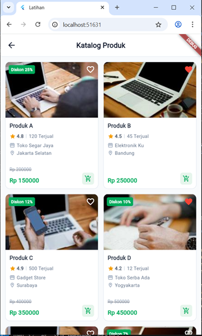
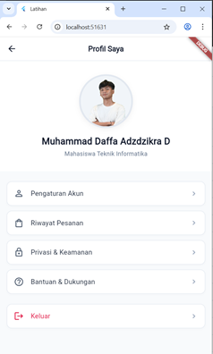

# Tugas Latihan Praktikum - Pertemuan 4

Aplikasi antarmuka toko daring (katalog produk) dan profil pengguna sederhana yang dibangun menggunakan framework **Flutter**. Proyek ini dibuat untuk memenuhi instruksi **Pertemuan 4** untuk mata kuliah Pemrograman Mobile.

## 📱 Fitur Utama

Aplikasi ini mendemonstrasikan pembuatan antarmuka pengguna (UI) modern dan responsif dengan menerapkan prinsip-prinsip tata letak pada Flutter. Di dalamnya terdapat dua bagian halaman:

### 1. Halaman Katalog Produk (`katalog_produk.dart`)
Menampilkan daftar produk layaknya aplikasi *e-commerce* dengan tata letak Grid.
- **Responsif:** Menggunakan tata letak yang dioptimasi agar jumlah kartu produk otomatis menyesuaikan dengan lebar layar otomatis, tanpa mengubah tinggi desain aslinya (`mainAxisExtent` mutlak).
- **Interaktif:** Berbasis `StatefulWidget`, pengguna dapat berinteraksi dengan menekan ikon Favorit (hati) di pojok setiap foto produk untuk menambahkan/menghilangkan tanda suka.
- **Kaya Data:** Masing-masing kartu dihiasi dengan banyak atribut informasi seperti gambar produk, label diskon, rating bintang, jumlah terjual, letak kota, dan harga yang dipangkas (coret).

### 2. Halaman Profil (`profile_page.dart`)
Menyediakan antarmuka manajemen akun yang berestetika bersih (*Clean UI*) ala aplikasi profesional.
- **Avatar Lokal:** Menggunakan paket aset gambar lokal secara langsung (tidak bergantung pada koneksi internet untuk foto), dengan bentuk membulat (`CircleAvatar`) berbingkai rapi.
- **Informasi Pribadi:** Menampilkan fokus nama pengembang: **Muhammad Daffa Adzdzikra D** dan gelar akademisnya.
- **Papan Menu:** Mengandung deret kartu menu pilihan fungsional seperti Pengaturan, Riwayat Pesanan, Bantuan & Dukungan hingga sebuah tombol fungsional merah untuk Keluar aplikasi.

## 🛠️ Spesifikasi Teknologi
- **Framework:** Flutter SDK
- **Bahasa:** Dart 
- **Penyimpanan:** Modul Gambar bersumber dari dalam penyimpanan project statis (Local Asset Bundle) di direktori `assets/images/`.

## 👤 Identitas Pengembang
- **Nama Lengkap:** Muhammad Daffa Adzdzikra D
- **Program Studi:** Teknik Informatika
- **Konteks Proyek:** Latihan / Tugas Pertemuan 4 (Pemrograman Mobile)

## 🚀 Cara Menjalankan Aplikasi Secara Lokal

1. Pastikan lingkungan pengembangan [Flutter](https://docs.flutter.dev/get-started/install) telah terpasang dengan baik dan stabil di komputer Anda.
2. Buka direktori proyek ini (`latihan/`) di dalam Terminal atau Command Prompt lokal Anda.
3. Unduh semua dependensi paket pub yang dibutuhkan dengan perintah:
   ```bash
   flutter pub get
   ```
4. Mulai dan kompilasi aplikasi ke emulator atau browser web bawaan:
   ```bash
   flutter run
   ```

*Atau, cukup klik tombol Run dan bereksperimen dengan **Hot Reload** langsung dari code editor Anda seperti VS Code atau Android Studio.*

## 📸 Tangkapan Layar (Screenshots)

Berikut adalah gambaran hasil akhir dari antarmuka aplikasi.
*(Perhatian: Untuk menampilkan gambar, silakan *save* atau masukan file *screenshot* Anda ke dalam folder `screenshots` dengan nama file `katalog.png` dan `profil.png`)*

### 🛒 Halaman Katalog



### 👤 Halaman Profil



