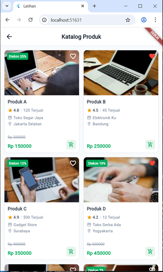
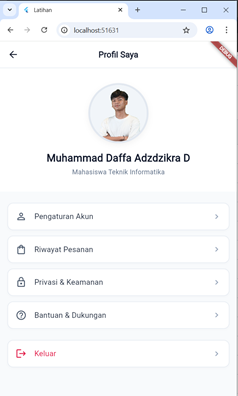

# 🏍️ Dafjek App Clone - Latihan Pertemuan 4

Aplikasi antarmuka layanan *on-demand* (berawal dari kloning aplikasi Gojek) yang telah disesuaikan dan direbranding menjadi **Dafjek**. Proyek ini dibangun menggunakan framework **Flutter** dan memuat implementasi *layouting* modern, navigasi multi-halaman yang kompleks, serta rekayasa antarmuka *aesthetic*. Proyek ini dibuat untuk memenuhi instruksi **Pertemuan 4** mata pelajaran Pemrograman Mobile.

## 📱 Fitur Utama & Struktur Antarmuka

Aplikasi ini mendemonstrasikan antarmuka pengguna (UI) yang komprehensif, diikat oleh **Bottom Navigation Bar** dan **Side Drawer** kustom. Aplikasi terbagi ke dalam empat halaman utama:

### 1. 🏠 Beranda (`home_page.dart`)
Halaman utama yang mengadopsi gaya UI aplikasi super-app.
- **DafPay Section:** Kartu dompet digital interaktif untuk menampilkan saldo, tombol Bayar, Top Up, dan Eksplor dengan gradasi biru khas.
- **MainMenu Icon Grid:** Deretan panggillan layanan fungsional seperti DafRide, DafCar, DafFood, DafSend, DafMart, DafPulsa, dan DafClub.
- **Promo Interaktif:** Terdapat kartu *scrollable* horizontal yang menawarkan diskon dan akses cepat (seperti *Cashback* DafPay, Gratis Ongkir DafSend).
- **Voucher Dafjek:** Susunan daftar kode promo yang *eye-catching* bernuansa *gradient* modern yang menarik perhatian pengguna.

### 2. 🛒 Katalog Produk (`katalog_produk.dart`)
Halaman presentasi layanan (terutama pengantaran makanan) berseni desain aplikasi *e-commerce* modern (mirip GoFood).
- **Grid Layout Responsif:** Menampilkan daftar katalog dengan struktur tata letak berkolom (`GridView`).
- **Kartu Produk Detail:** Menyajikan informasi berlimpah pada produk/resto, mulai dari letak kota, rating/bintang, jumlah terjual, *badge* diskon, harga coret, serta harga aktual.
- **Interaksi Favorit:** Disertai ikon `Stateful` fungsional (bentuk hati) yang dapat ditekan guna memberikan tanda simpan/favorit secara visual.

### 3. 🔔 Notifikasi (`notification_page.dart`)
Halaman tab khusus tempat penampungan riwayat transaksional, info akun, atau aktivitas (*placeholder* aplikasi pada umumnya).

### 4. 👤 Profil Pengguna (`profile_page.dart`)
Antarmuka manajemen akun pengguna dengan estetika *Clean UI*.
- **Avatar Lokal Tersuai:** Menggunakan bundel aset gambar lokal asli (`assets/images/Profile.png`) dengan figur avatar melingkar elegan (`CircleAvatar`).
- **Informasi Pribadi:** Menampilkan fokus identitas bernama **Muhammad Daffa Adzdzikra D** sebagai identitas utama pembuat.
- **Panel Pengaturan:** Menampung papan kartu opsi yang lengkap (Pengaturan, Daftar Alamat, Pusat Bantuan), dan dibekali dengan tombol khusus destruktif bergaya merah untuk pilihan **Keluar**.

## 🧭 Navigasi Pusat (`main_screen.dart`)
Bertindak sebagai fondasi *wrapper* tempat kontrol perutean aplikasi diberlakukan.
- Kontrol dan perpindahan state yang harmonis dan tersinkronisasi mulus mendayagunakan kolaborasi integrasi **`BottomNavigationBar`** maupun menu sorong kiri **`Drawer`**.
- Seluruh *tab* indeks diamankan performanya dan laju statenya tidak akan diulang/direset menggunakan teknik retensi state multi halaman.

## 🛠️ Spesifikasi Teknologi
- **Framework Utama:** Flutter SDK
- **Bahasa Pemrograman:** Dart
- **Aset Modul Lokal:** Mengandalkan repositori gambar statis dalam ruang lingkup aplikasi secara internal pada *directory* `/assets/images/`.

## 👤 Identitas Pengembang Proyek
- **Pengembang:** Muhammad Daffa Adzdzikra D
- **Program Studi/Bidang:** Teknik Informatika / IT
- **Konteks Penggunaan:** Proyek Latihan / Tugas Pertemuan 4 Pemrograman Mobile

## 🚀 Cara Menjalankan Aplikasi Secara Lokal

1. Pastikan Anda telah memasang lingkungan pengembangan [Flutter SDK](https://docs.flutter.dev/get-started/install) dengan sempurna di peranti lokal Anda.
2. Buka folder dari repositori/proyek ini (`latihan/`) menggunakan alat baris perintah (*Command Prompt* / Terminal).
3. Jalankan pengambilan/pembaruan paket dependensi dengan mengetikkan:
   ```bash
   flutter pub get
   ```
4. Lakukan proses kompilasi awal dan pasangkan (*run*) ke emulator/perangkat fisik Anda:
   ```bash
   flutter run
   ```

*Tips: Gunakan kombinasi **Hot Reload** konvensional (contoh: tekan tuts `r`) untuk menyegarkan cuplikan koding UI tanpa butuh dimuat ulang secara menyeluruh.*

## 📸 Tangkapan Layar (Screenshots)

Berikut penampakan desain antarmuka akhir dari replikasi kloning Dafjek:

*(Sila tambahkan dan letakkan tangkapan layar perangkat/emulator nyata (*real device screenshot*) ke dalam folder baru penampungan bernama `screenshots` untuk menyalakan fitur perenderan gambar di bawah)*

- **Halaman Beranda (Home)**
  <br>

- **Halaman Katalog Belanja**
  <br>

- **Halaman Profil Akun**
  <br>
